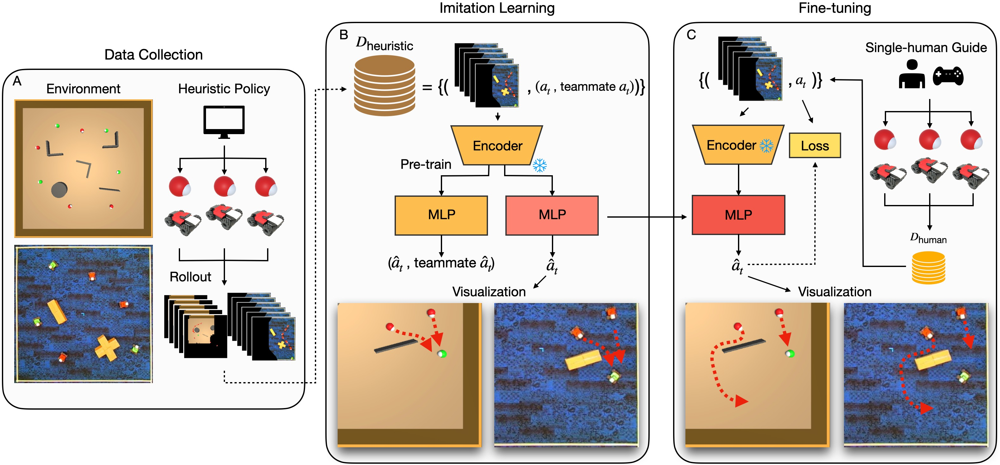
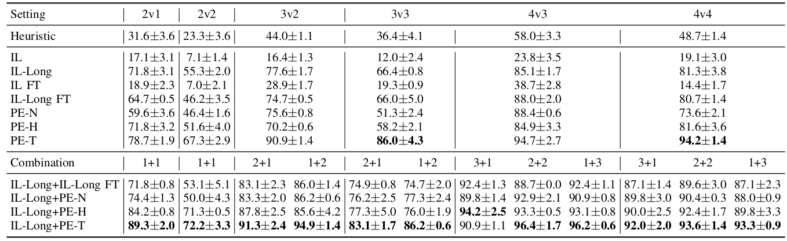
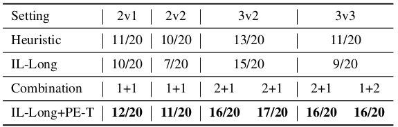

# HUMAC: Enabling Multi-Robot Collaboration from Single-Human Guidance
[Zhengran Ji](https://jzr01.github.io/)¹, [Lingyu Zhang](https://lingyu98.github.io/)¹, [Paul Sajda](https://liinc.bme.columbia.edu/people/paul-sajda)², [Boyuan Chen](http://boyuanchen.com/)¹

¹ Duke University, ² Columbia University


## Overview
Learning collaborative behaviors is essential for multi-agent systems. Traditionally, multi-agent reinforcement learning solves this implicitly through a joint reward and centralized observations, assuming collaborative behavior will emerge. Other studies propose to learn from demonstrations of a group of collaborative experts. Instead, we propose an efficient and explicit way of learning collaborative behaviors in multi-agent systems by leveraging expertise from only a single human. Our insight is that humans can naturally take on various roles in a team. We show that agents can effectively learn to collaborate by allowing a human operator to dynamically switch between controlling agents for a short period and incorporating a human-like theory-of-mind model of teammates. Our experiments showed that our method improves the success rate of a challenging collaborative hide-and-seek task by up to 58% with only 40 minutes of human guidance. We further demonstrate our findings transfer to the real world by conducting multi-robot experiments.



## Result
### Simulation Success Rate (%)


### Real-World Experiment Success Rate (%)



## Quick Start

1. Clone the repository:

    ```bash
    git clone https://github.com/generalroboticslab/HUMAC.git
    ```
2. To run the simulation part of the paper, install [CREW](https://github.com/generalroboticslab/CREW). There are more detailed instruction in the [Simulation](https://github.com/generalroboticslab/HUMAC/tree/main/Simulation) folder.

3. To run the real-world experiment part of the paper, navigate to [Real-World](https://github.com/generalroboticslab/HUMAC/tree/main/Real-World) folder for detailed instructiom.

## Repo Structure
```plaintext
├── /Simulation/              # Documentation files
│   └── /crew-algorithm/
│   └── /environment/
│   └── /training/
├── /Real-World/               # Source code for the project
├── README.md           # Project overview and instructions
└── LICENSE             # License for the project

```

## Acknowledgement
[DJI Robomaster_sdk](https://github.com/dji-sdk/RoboMaster-SDK)

## Citation

If you think this paper is helpful, please consider cite our work

    ```bash
    git clone https://github.com/generalroboticslab/HUMAC.git
    ```

## Collecting Data

Run the following command to collect heuristic data or human involve data.

### simulation
```bash
cd Simulation/crew-algorithms/crew_algorithms/
export PYTHONPATH=..:$PYTHONPATH
WANDB_MODE=disabled python collect_data envs.num_seekers=[num_seekers] envs.num_hiders=[num_hiders] envs.start_seed=[starting_seed] envs.num_games=[num_games]
```

### Real-world
```bash
cd Real-World/Hide-and-Seek-real-robot/
python collect_heuristic_data.py
```

## Training
Run the following command to train or fine-tune the model.

### simulation
```bash
cd Simulation/training/
python train.py
```

### real-world
```bash
cd Real-World/training/
python train.py 
```

## Evaluation

To evaluate the trained models and log the performance, run:

### simulation
```bash
cd Simulation/crew-algorithms/crew_algorithms/
export PYTHONPATH=..:$PYTHONPATH
WANDB_MODE=disabled python test envs.num_seekers=[num_seekers] envs.num_hiders=[num_hiders] envs.start_seed=[starting_seed] envs.num_games=[num_games]
```

### real-world

```bash
cd Real-World/Hide-and-Seek-real-robot/
python collect_heuristic_data.py
```

