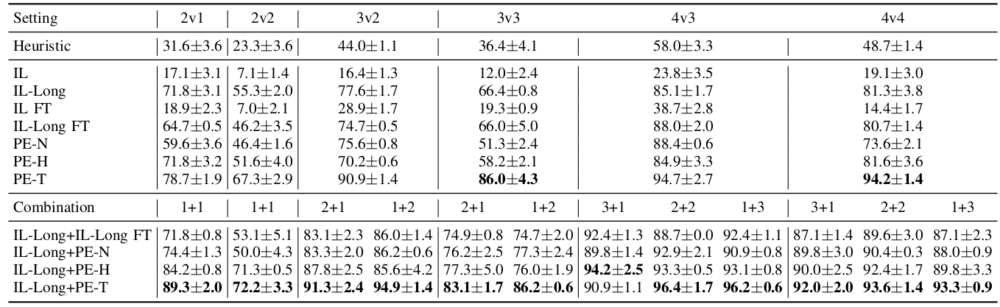
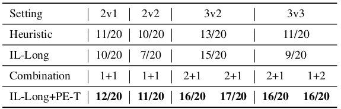

# HUMAC: Enabling Multi-Robot Collaboration from Single-Human Guidance
[Zhengran Ji](https://jzr01.github.io/)¹, [Lingyu Zhang](https://lingyu98.github.io/)¹, [Paul Sajda](https://liinc.bme.columbia.edu/people/paul-sajda)², [Boyuan Chen](http://boyuanchen.com/)¹

¹ Duke University, ² Columbia University

[website](http://generalroboticslab.com/HUMAC) | [paper](https://arxiv.org/abs/2409.19831) | [video](https://www.youtube.com/watch?v=2X92LnFTutY)


## Overview
Learning collaborative behaviors is essential for multi-agent systems. Traditionally, multi-agent reinforcement learning solves this implicitly through a joint reward and centralized observations, assuming collaborative behavior will emerge. Other studies propose to learn from demonstrations of a group of collaborative experts. Instead, we propose an efficient and explicit way of learning collaborative behaviors in multi-agent systems by leveraging expertise from only a single human. Our insight is that humans can naturally take on various roles in a team. We show that agents can effectively learn to collaborate by allowing a human operator to dynamically switch between controlling agents for a short period and incorporating a human-like theory-of-mind model of teammates. Our experiments showed that our method improves the success rate of a challenging collaborative hide-and-seek task by up to 58% with only 40 minutes of human guidance. We further demonstrate our findings transfer to the real world by conducting multi-robot experiments.


## Result
### Simulation Success Rate (%)


### Real-World Experiment Success Rate (%)



## Quick Start

1. Clone the repository:

    ```bash
    git clone https://github.com/generalroboticslab/HUMAC.git
    ```
2. To run the simulation part of the paper, install [CREW](https://github.com/generalroboticslab/CREW). There are more detailed instruction in the [Simulation](https://github.com/generalroboticslab/HUMAC/tree/main/Simulation) folder.

3. To run the real-world experiment part of the paper, navigate to [Real-World](https://github.com/generalroboticslab/HUMAC/tree/main/Real-World) folder for detailed instructiom.

## Repository Structure
This repository has this following structure
```plaintext
├── Simulation              
│   └── crew-algorithms
│   └── environment
│   └── training
├── Real-World
│   └── environment
│   └── training
├── images
├── .gitignore              
├── README.md           
└── LICENSE             

```

## Acknowledgement


This work is supported by ARL STRONG program under awards W911NF2320182 and W911NF2220113. We also thank [Jiaxun Liu](https://www.jiaxunliu.com/) for helping with the hardware setup.


## Citation

If you think this paper is helpful, please consider cite our work

```plaintext
@misc{ji2024enablingmultirobotcollaborationsinglehuman,
      title={Enabling Multi-Robot Collaboration from Single-Human Guidance}, 
      author={Zhengran Ji and Lingyu Zhang and Paul Sajda and Boyuan Chen},
      year={2024},
      eprint={2409.19831},
      archivePrefix={arXiv},
      primaryClass={cs.RO},
      url={https://arxiv.org/abs/2409.19831}, 
}
```

