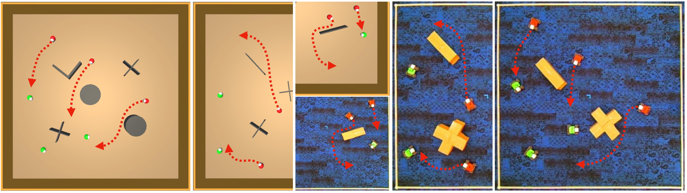

# HUMAC: Enabling Multi-Robot Collaboration from Single-Human Guidance
[Zhengran Ji](https://jzr01.github.io/)¹, [Lingyu Zhang](https://lingyu98.github.io/)¹, [Paul Sajda](https://liinc.bme.columbia.edu/people/paul-sajda)², [Boyuan Chen](http://boyuanchen.com/)¹

¹ Duke University, ² Columbia University




## Overview
Learning collaborative behaviors is essential for multi-agent systems. Traditionally, multi-agent reinforcement learning solves this implicitly through a joint reward and centralized observations, assuming collaborative behavior will emerge. Other studies propose to learn from demonstrations of a group of collaborative experts. Instead, we propose an efficient and explicit way of learning collaborative behaviors in multi-agent systems by leveraging expertise from only a single human. Our insight is that humans can naturally take on various roles in a team. We show that agents can effectively learn to collaborate by allowing a human operator to dynamically switch between controlling agents for a short period and incorporating a human-like theory-of-mind model of teammates. Our experiments showed that our method improves the success rate of a challenging collaborative hide-and-seek task by up to 58% with only 40 minutes of human guidance. We further demonstrate our findings transfer to the real world by conducting multi-robot experiments.


## Result
<h2>Simulation Success Rate (%)</h2>
<table style="width: 100%; border-collapse: collapse; text-align: center;">
    <caption>Simulation Success Rate ($\%$)</caption>
    <thead>
        <tr>
            <th>Setting</th>
            <th>2v1</th>
            <th>2v2</th>
            <th colspan="2">3v2</th>
            <th colspan="2">3v3</th>
            <th colspan="3">4v3</th>
            <th colspan="3">4v4</th>
        </tr>
    </thead>
    <tbody>
        <tr>
            <td>Heuristic</td>
            <td>31.6±3.6</td>
            <td>23.3±3.6</td>
            <td colspan="2">44.0±1.1</td>
            <td colspan="2">36.4±4.1</td>
            <td colspan="3">58.0±3.3</td>
            <td colspan="3">48.7±1.4</td>
        </tr>
        <tr>
            <td>IL</td>
            <td>17.1±3.1</td>
            <td>7.1±1.4</td>
            <td colspan="2">16.4±1.3</td>
            <td colspan="2">12.0±2.4</td>
            <td colspan="3">23.8±3.5</td>
            <td colspan="3">19.1±3.0</td>
        </tr>
        <tr>
            <td>IL-Long</td>
            <td>71.8±3.1</td>
            <td>55.3±2.0</td>
            <td colspan="2">77.6±1.7</td>
            <td colspan="2">66.4±0.8</td>
            <td colspan="3">85.1±1.7</td>
            <td colspan="3">81.3±3.8</td>
        </tr>
        <tr>
            <td>IL FT</td>
            <td>18.9±2.3</td>
            <td>7.0±2.1</td>
            <td colspan="2">28.9±1.7</td>
            <td colspan="2">19.3±0.9</td>
            <td colspan="3">38.7±2.8</td>
            <td colspan="3">14.4±1.7</td>
        </tr>
        <tr>
            <td>IL-Long FT</td>
            <td>64.7±0.5</td>
            <td>46.2±3.5</td>
            <td colspan="2">74.7±0.5</td>
            <td colspan="2">66.0±5.0</td>
            <td colspan="3">88.0±2.0</td>
            <td colspan="3">80.7±1.4</td>
        </tr>
        <tr>
            <td>PE-N</td>
            <td>59.6±3.6</td>
            <td>46.4±1.6</td>
            <td colspan="2">75.6±0.8</td>
            <td colspan="2">51.3±2.4</td>
            <td colspan="3">88.4±0.6</td>
            <td colspan="3">73.6±2.1</td>
        </tr>
        <tr>
            <td>PE-H</td>
            <td>71.8±3.2</td>
            <td>51.6±4.0</td>
            <td colspan="2">70.2±0.6</td>
            <td colspan="2">58.2±2.1</td>
            <td colspan="3">84.9±3.3</td>
            <td colspan="3">81.6±3.6</td>
        </tr>
        <tr>
            <td>PE-T</td>
            <td>78.7±1.9</td>
            <td>67.3±2.9</td>
            <td colspan="2">90.9±1.4</td>
            <td colspan="2"><strong>86.0±4.3</strong></td>
            <td colspan="3">94.7±2.7</td>
            <td colspan="3"><strong>94.2±1.4</strong></td>
        </tr>
        <tr>
            <td>Combination</td>
            <td>1+1</td>
            <td>1+1</td>
            <td>2+1</td>
            <td>1+2</td>
            <td>2+1</td>
            <td>1+2</td>
            <td>3+1</td>
            <td>2+2</td>
            <td>1+3</td>
            <td>3+1</td>
            <td>2+2</td>
            <td>1+3</td>
        </tr>
        <tr>
            <td>IL-Long+IL-Long FT</td>
            <td>71.8±0.8</td>
            <td>53.1±5.1</td>
            <td>83.1±2.3</td>
            <td>86.0±1.4</td>
            <td>74.9±0.8</td>
            <td>74.7±2.0</td>
            <td>92.4±1.3</td>
            <td>88.7±0.0</td>
            <td>92.4±1.1</td>
            <td>87.1±1.4</td>
            <td>89.6±3.0</td>
            <td>87.1±2.3</td>
        </tr>
        <tr>
            <td>IL-Long+PE-N</td>
            <td>74.4±1.3</td>
            <td>50.0±4.3</td>
            <td>83.3±2.0</td>
            <td>86.2±0.6</td>
            <td>76.2±2.5</td>
            <td>77.3±2.4</td>
            <td>89.8±1.4</td>
            <td>92.9±2.1</td>
            <td>90.9±0.8</td>
            <td>89.8±3.0</td>
            <td>90.4±0.3</td>
            <td>88.0±0.9</td>
        </tr>
        <tr>
            <td>IL-Long+PE-H</td>
            <td>84.2±0.8</td>
            <td>71.3±0.5</td>
            <td>87.8±2.5</td>
            <td>85.6±4.2</td>
            <td>77.3±5.0</td>
            <td>76.0±1.9</td>
            <td><strong>94.2±2.5</strong></td>
            <td>93.3±0.5</td>
            <td>93.1±0.8</td>
            <td>90.0±2.5</td>
            <td>92.4±1.7</td>
            <td>89.8±3.3</td>
        </tr>
        <tr>
            <td>IL-Long+PE-T</td>
            <td><strong>89.3±2.0</strong></td>
            <td><strong>72.2±3.3</strong></td>
            <td><strong>91.3±2.4</strong></td>
            <td><strong>94.9±1.4</strong></td>
            <td><strong>83.1±1.7</strong></td>
            <td><strong>86.2±0.6</strong></td>
            <td>90.9±1.1</td>
            <td><strong>96.4±1.7</strong></td>
            <td><strong>96.2±0.6</strong></td>
            <td><strong>92.0±2.0</strong></td>
            <td><strong>93.6±1.4</strong></td>
            <td><strong>93.3±0.9</strong></td>
        </tr>
    </tbody>
</table>


## Real-World Experiment Success Rate (%)
<table style="text-align: center;">
    <thead>
        <tr>
            <th style="text-align: center;">Setting</th>
            <th style="text-align: center;">2v1</th>
            <th style="text-align: center;">2v2</th>
            <th colspan="2" style="text-align: center;">3v2</th>
            <th colspan="2" style="text-align: center;">3v3</th>
        </tr>
    </thead>
    <tbody>
        <tr>
            <td style="text-align: center;">Heuristic</td>
            <td style="text-align: center;">11/20</td>
            <td style="text-align: center;">10/20</td>
            <td colspan="2" style="text-align: center;">13/20</td>
            <td colspan="2" style="text-align: center;">11/20</td>
        </tr>
        <tr>
            <td style="text-align: center;">IL-Long</td>
            <td style="text-align: center;">10/20</td>
            <td style="text-align: center;">7/20</td>
            <td colspan="2" style="text-align: center;">15/20</td>
            <td colspan="2" style="text-align: center;">9/20</td>
        </tr>
        <tr>
            <td style="text-align: center;">Combination</td>
            <td style="text-align: center;">1+1</td>
            <td style="text-align: center;">1+1</td>
            <td style="text-align: center;">2+1</td>
            <td style="text-align: center;">1+2</td>
            <td style="text-align: center;">2+1</td>
            <td style="text-align: center;">1+2</td>
        </tr>
        <tr>
            <td style="text-align: center;">IL-Long + PE-T</td>
            <td style="text-align: center;"><strong>12/20</strong></td>
            <td style="text-align: center;"><strong>11/20</strong></td>
            <td style="text-align: center;"><strong>16/20</strong></td>
            <td style="text-align: center;"><strong>17/20</strong></td>
            <td style="text-align: center;"><strong>16/20</strong></td>
            <td style="text-align: center;"><strong>16/20</strong></td>
        </tr>
    </tbody>
</table>


## Prerequisites

1. Clone the repository:

    ```bash
    git clone https://github.com/generalroboticslab/HUMAC.git
    ```
2. Install [CREW](https://github.com/generalroboticslab/CREW) for simulation

3. Install dependency for real-robot

   ```bash
   pip install -r requirements.txt
   ```
    
## Collecting Data

Run the following command to collect heuristic data or human involve data.

### simulation
```bash
cd Simulation/crew-algorithms/crew_algorithms/
export PYTHONPATH=..:$PYTHONPATH
WANDB_MODE=disabled python collect_data envs.num_seekers=[num_seekers] envs.num_hiders=[num_hiders] envs.start_seed=[starting_seed] envs.num_games=[num_games]
```

### Real-world
```bash
cd Real-World/Hide-and-Seek-real-robot/
python collect_heuristic_data.py
```

## Training
Run the following command to train or fine-tune the model.

### simulation
```bash
cd Simulation/training/
python train.py
```

### real-world
```bash
cd Real-World/training/
python train.py 
```

## Evaluation

To evaluate the trained models and log the performance, run:

### simulation
```bash
cd Simulation/crew-algorithms/crew_algorithms/
export PYTHONPATH=..:$PYTHONPATH
WANDB_MODE=disabled python test envs.num_seekers=[num_seekers] envs.num_hiders=[num_hiders] envs.start_seed=[starting_seed] envs.num_games=[num_games]
```

### real-world

```bash
cd Real-World/Hide-and-Seek-real-robot/
python collect_heuristic_data.py
```

## Acknowledgement
[DJI Robomaster_sdk](https://github.com/dji-sdk/RoboMaster-SDK)
