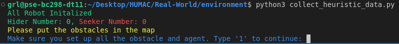
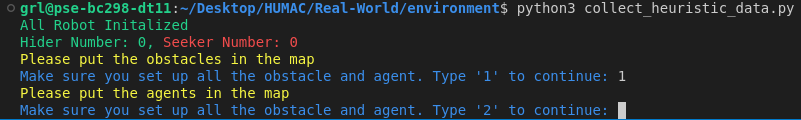
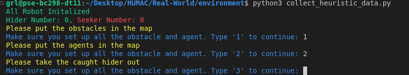

# Real-World Experiment

## Hardware setup 

[Vicon Motion Tracking System](https://www.vicon.com/) <br>

[Robot](https://www.dji.com/robomaster-ep)

[RGB Camera]()

## Install the dependency 
```bash
cd Real-World
pip install -r requirements.txt
```
## Start Listening Data from Vicon System

```bash
cd ~/catkin_ws
catkin_make
source devel/setup.sh
roslaunch vicon_bridge vicon.launch
```

## Name Robot and Prepare the Json File

The key is the ip address of the robot, and the value is a list with [Unique ID on robot smart controller, agent name]. Please save the json file as robot_info.json into the folder:

```plaintext
HUMAC/Real-World/environment/
```
The agent name must be like Seeker{ID} or Hider{ID}. The ID should start from 1 and increase as the number of robots increases. An example robot_info.json will be like:

```plaintext
{"192.168.0.123":["159CKCH0070ACX","Seeker1"],
"192.168.0.154":["159CL170070WES","Seeker2"],
"192.168.0.166":["159CL170070CDD","Seeker3"],
"192.168.0.188":["159CL170070CVT","Hider1"],
"192.168.0.199":["159CKCH0070WEF","Hider2"],
"192.168.0.100":["159CL170070GTE","Hider3"]}
```

## Connect Robot to Wifi
Power up the DJI robomaster, and change the smart controller on it to connect to router.
Then run the following command:

```bash
cd Real-World/environment/
python connect_robot_to_wifi.py 
```

After successfully connecting to wifi, there will be a prompt in the terminal, as well as a sound from the speaker of the robot.

## Collecting Data

To collect data, prepare the amount of robot you need. For example, if you want to collect collect 2 Seekers vs 1 Hider data, you need to power up Seeker1, Seeker2, and Hider1. The ID of the robot you power matters in this case. 

### Heuristic Data

Run the following command to start the process:

```bash
cd Real-World/environment/
python collect_heuristic_data.py  
```

The prompt will be like this 

1. **Setup the arena**:



Put only the obstacles in the arena then press '1' and enter.


2. **Spawn the Robots**:



Put all the robots in the arena then press '2' to start the episode.

3. **Take out the caught hider**:



As the game proceed, if any hider robot is caught, the whole game will be paused and you need to take the caught one (The Led Light of the hider robot will turn from green to blue) out of the arena. After that, press '3' and enter to resume the game.


### Human Data
For collecting human data, run 

```bash
cd Real-World/environment/
python collect_human_data.py  
```

Everything else stay the same. Use the UI popped up to guide the robots. Left-click to set robot destination and right-click to switch between robots.

## Trained Policies
If you wish to use the policies we trained and skip the training and fine-tuning, you can download them [here](https://drive.google.com/drive/folders/1PD8xUyoZI92qHqNpSBPHLH5rsxumaeYC?usp=sharing). After you download them, please move them under the 
```bash
HUMAC\Simulation\model_weights
```
folder to make sure the evaluation runs smoothly.


## Training and Fine-tuning

We have four policies in the paper, which are **`IL / IL-Long`**, **`PE-N`**, **`PE-H`**, and **`PE-T`**. You can train each of these policies by running the respective training script. 

To train any of the policies, follow the steps below:

1. **Navigate to the training directory**:
    ```bash
    cd Simulation/training/
    ```
    
2. **Run the training script**:
    Use the appropriate policy name in place of **`{policy_name}`** (**`IL`**, **`PE-N`**, **`PE-H`**, or **`PE-T`**), and provide any specific arguments as needed:
   ```bash
    WANDB_MODE=disabled python train_{policy_name}.py --seed_value [seed_value] --batch_size [batch_size] --learning_rate [learning_rate] --epochs [epochs] --num_of_frames [num_of_frames] --step_ahead [step_ahead] --data_root_folder [path/to/data] 
   ```

3. **Fine-tuning**:
    ```bash
    --seed_value [seed_value] --batch_size [batch_size] --learning_rate [learning_rate] --epochs [epochs] --num_of_frames [num_of_frames] --step_ahead [step_ahead] --data_root_folder [path/to/data] --model [model_name]
    ```

4. **Available command-line arguments**:
    - **`--seed_value`**: The seed value for randomness to ensure reproducibility (default: 42).
    - **`--batch_size`**: The batch size for the data loader (default: 128).
    - **`--learning_rate`**: The learning rate for the optimizer (default: 0.001).
    - **`--epochs`**: The number of training epochs (default: 150).
    - **`--num_workers`**: The number of CPU workers used for data loading (default: 1).
    - **`--num_of_frames`**: The number of frames to stack (default: 5).
    - **`--step_ahead`**: The number of steps ahead for prediction. Setting step_ahead to be 1 is training IL, and making it > 1 is predicting longer than 1 step which refers to IL-Long in the paper.
    - **`--data_root_folder`**: The root folder path for the dataset (default: "path/to/IL/data").
    - **`--model`**: The name of the model to fine-tune.

All the models will be saved under the 
```bash
HUMAC\Simulation\model_weights
```
folder. 

### Notes:
- **Weights & Biases (WandB)**: If you're using [WandB](https://wandb.ai/), ensure you set **`WANDB_MODE=online`** and have your API key configured. If you want to disable it, you can use **`WANDB_MODE=disabled`** as shown in the examples.

## Evaluation

To evaluate the trained models run the following:

```bash
cd Real-World/environment/
python test_policy.py
```

